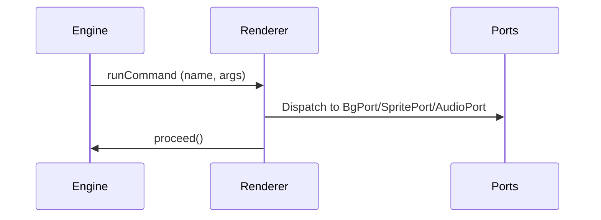

# Visual Novel Engine (monorepo)

Quickstart

- Requirements: Node.js 18+ and npm 8+.
- Install deps: npm install
- Build engine packages (core + renderer): npm run build:packages
- Run tests: npm test
- Typecheck all packages: npm run typecheck
- Run the demo web app (webpack): npm start (http://localhost:8080)
- Run the author app (Vite): npm run dev -w apps/author (http://localhost:5173)
- Run the clean smoke test app (Vite): npm run dev:zero (http://localhost:3100)

You can also use VS Code: F5 on “Launch Web App (webpack)” or “Launch Author App (Vite)”. Tasks for build, test, lint, and typecheck are included in .vscode/tasks.json.

---

## Monorepo Overview

Packages (consumable):
- `@vn/core` – Engine: node graph traversal (next/proceed/choose), instruction stream, flags, and snapshots.
- `@vn/renderer-web` – React VNPlayer that renders a `GameScript` via the engine, dispatching `runCommand` to platform ports.

Apps (for demos and tooling):
- `apps/web-demo` – Legacy demo using webpack.
- `apps/author` – Authoring UI prototype (Vite).
- `apps/chakrahearts-zero` – Minimal clean app to smoke test engine + renderer end-to-end.

---

## Install and Build

1) Install dependencies

```powershell
npm install
```

2) Build engine packages (creates `packages/*/dist`)

```powershell
npm run build:packages
```

3) Run tests and typecheck

```powershell
npm test
npm run typecheck
```

---

## Run the Example Apps

- Demo (webpack):

```powershell
npm start
```

Opens http://localhost:8080

- Author app (Vite):

```powershell
npm run dev -w apps/author
```

Opens http://localhost:5173

- ChakraHearts Zero smoke test (Vite):

```powershell
npm run dev:zero
```

Opens http://localhost:3100 and shows a tiny script: two dialogue lines → a choice → end. This is ideal for verifying engine upgrades quickly.

---

## Using the Engine in Your App (local dev)

Until packages are published, you can consume them locally from this repo:

1) Build the packages here (once):

```powershell
cd path\to\vnEngine
npm install
npm run build:packages
```

2) In your app’s `package.json`, add local file deps:

```json
{
	"dependencies": {
		"@vn/core": "file:../vnEngine/packages/core",
		"@vn/renderer-web": "file:../vnEngine/packages/renderer-web"
	}
}
```

3) If you use Vite + TS, add aliases/paths pointing at the package folders (so dev mode resolves sources) and rely on built `dist` types:

- Vite `resolve.alias`:

```ts
import path from 'node:path'
export default {
	resolve: {
		alias: {
			'@vn/core': path.resolve(__dirname, '../vnEngine/packages/core'),
			'@vn/renderer-web': path.resolve(__dirname, '../vnEngine/packages/renderer-web')
		}
	}
}
```

- TS `paths` (to types generated in `dist`):

```json
{
	"compilerOptions": {
		"paths": {
			"@vn/core": ["../vnEngine/packages/core/dist/src/index.d.ts"],
			"@vn/renderer-web": ["../vnEngine/packages/renderer-web/dist/index.d.ts"]
		}
	}
}
```

4) Use the React renderer in your app:

```tsx
import { VNPlayer } from '@vn/renderer-web'
import type { GameScript } from '@vn/core'

const script: GameScript = {
	scenes: [
		{
			id: 'intro',
			nodes: {
				start: { id: 'start', kind: 'dialogue', speaker: 'Ava', text: 'Hello!', next: 'end' },
				end: { id: 'end', kind: 'end' }
			},
			start: 'start'
		}
	],
	startScene: 'intro'
}

export default function App() {
	return <VNPlayer script={script} />
}
```

---

# Commands System

## Command Table

| Command Name   | Args Schema                                              | Typical Effect         | Executed By |
|--------------- |---------------------------------------------------------|-----------------------|-------------|
| setBackground  | { name: 'setBackground', key: string }                  | Change background     | BgPort      |
| showSprite     | { name: 'showSprite', id: string, pose?: string, at? }  | Show sprite           | SpritePort  |
| hideSprite     | { name: 'hideSprite', id: string }                      | Hide sprite           | SpritePort  |
| playMusic      | { name: 'playMusic', idOrUrl: string, loop?: boolean }  | Play music/audio      | AudioPort   |
| stopMusic      | { name: 'stopMusic', id?: string }                      | Stop music/audio      | AudioPort   |
| setFlag        | { name: 'setFlag', key: string, value: boolean }        | Set engine flag       | Renderer    |

## Sequence Diagram



## Notes
- The engine emits runCommand instructions for command nodes, but does not mutate UI/audio/flags directly.
- Renderer dispatches commands to platform ports and calls engine.proceed() after handling.
- Flags are only mutated when renderer calls engine.setFlag(key, value).
# VNEngine Monorepo Milestone Summary & Roadmap

## 1. Core Modules Status
- ✅ Core engine (`NodeVNEngine`): node graph traversal (next/proceed/choose), instruction stream, snapshots
- ✅ Script package: JSON schema + types; DSL stubs present
- ✅ Renderer-web (`VNPlayer`): React renderer aligned to engine pull API; dialogue, choices, runCommand, end
- ✅ Storage (local adapters): basic slot-based save/load
- ✅ Tests: core engine traversal/branching/commands covered by vitest
- ✅ New clean app: `apps/chakrahearts-zero` minimal smoke test (Vite)
- ☑️ Author app prototype: Vite-based playground (work-in-progress)
- ☑️ Assets/ports: background/sprites/audio ports wired with basic handlers; transitions/effects TBD

## 2. Progress Checklist
- ✅ Core engine: modular, node-based, snapshot/hydrate
- ✅ Script: JSON schema/types, validators; DSL scaffolding
- ✅ Renderer-web: dialogue, choices, runCommand dispatch; keyboard UX
- ✅ Smoke tests: `chakrahearts-zero` app exercises core loop
- ☑️ Ports: bg/sprite/audio interfaces defined; web impl basic (no transitions yet)
- ☑️ Storage: local adapters ok; cross-platform adapters pending
- ☑️ Authoring: prototype app exists; parser/editor features in progress
- ❌ Native portability: RN renderer + AsyncStorage adapter
- ❌ Advanced tests: long-form branching, integrity, error reporting CI

## 3. Minimal Test Scenes & CI Checks
- Test scenes:
	- Dialogue with choices, branching, commands (bg/music/flag)
	- Save before choice, load, pick alternate path
- CI checks:
	- Build: `npx tsc --build`
	- Lint: `npx eslint .`
	- Tests: `npx vitest run`

## 4. Release Roadmap
- 0.1.0 (current): Core engine + web renderer playable; save/load; basic branching; zero app
- 0.2.0: Ports polish (bg transitions, sprite layers/positions, WebAudio fades/looping), flags API, error surfaces
- 0.3.0: Authoring tools (split-pane editor, DSL parser MVP, live preview + validator)
- 0.4.0: React Native renderer, AsyncStorage adapter; storage abstractions unified

## 5. Architecture & Contribution Workflow

### Architecture Overview
- Core (engine)
	- `NodeVNEngine` exposes a pull-based loop: `next()` → instruction; renderer handles then calls `proceed()` or `choose(id)`.
	- Instructions include: `showDialogue`, `showChoices`, `runCommand`, `showBranch`, `end`.
	- Snapshot/hydrate for save/load.
- Renderer (web)
	- `VNPlayer` React component renders the instruction stream.
	- Dispatches `runCommand` to platform ports and then calls `engine.proceed()`.
- Ports
	- Background, Sprites, Audio ports define minimal contracts; web implementations are basic and ready to extend (transitions/effects pending).
- Script
	- JSON schema/types for `GameScript`; DSL parser stubs and validators.
- Storage
	- Local slot-based adapters; async/native adapters planned.
- Apps
	- `web-demo`, `author` prototype, and `chakrahearts-zero` smoke test.

### Contribution Workflow
1. Fork & clone repo, install dependencies (`npm install`)
2. Build all packages (`npx tsc --build`)
3. Run demo app (`npm start` or via Vite)
4. Add features/tests in modular packages
5. Submit PRs with clear checklist, tests, and documentation

# vnEngine

A scalable, modular Visual Novel engine built with React, TypeScript, and Turborepo monorepo structure.

## Features
- Node-based engine core with pull API (next/proceed/choose)
- Dialogue, choices, command dispatch, branching
- Background/Sprites/Audio ports (web impl basic; extensible)
- Snapshot/save/load support
- JSON script format with schema/types; DSL scaffolding
- React web renderer (`VNPlayer`)
- Example apps: webpack demo, author prototype, and chakrahearts-zero

## Getting Started
See the monorepo structure and packages for usage examples.
