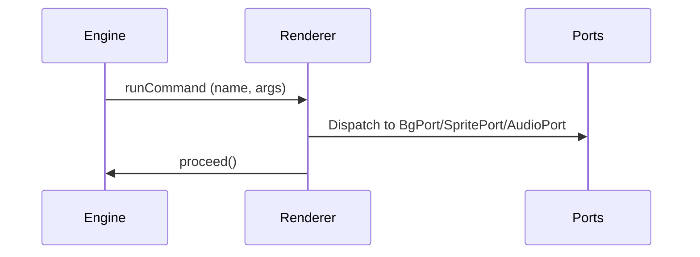

# Visual Novel Engine (monorepo)

Quickstart

- Requirements: Node.js 18+ and npm 8+.
- Install deps: npm install
- Run the demo web app: npm start (opens http://localhost:8080)
- Run the author app: npm run dev -w apps/author (Vite on http://localhost:5173)
- Run tests: npm test
- Typecheck all packages: npm run typecheck

You can also use VS Code: F5 on “Launch Web App (webpack)” or “Launch Author App (Vite)”. Tasks for build, test, lint, and typecheck are included in .vscode/tasks.json.

---

# Commands System

## Command Table

| Command Name   | Args Schema                                              | Typical Effect         | Executed By |
|--------------- |---------------------------------------------------------|-----------------------|-------------|
| setBackground  | { name: 'setBackground', key: string }                  | Change background     | BgPort      |
| showSprite     | { name: 'showSprite', id: string, pose?: string, at? }  | Show sprite           | SpritePort  |
| hideSprite     | { name: 'hideSprite', id: string }                      | Hide sprite           | SpritePort  |
| playMusic      | { name: 'playMusic', idOrUrl: string, loop?: boolean }  | Play music/audio      | AudioPort   |
| stopMusic      | { name: 'stopMusic', id?: string }                      | Stop music/audio      | AudioPort   |
| setFlag        | { name: 'setFlag', key: string, value: boolean }        | Set engine flag       | Renderer    |

## Sequence Diagram

## Notes
- The engine emits runCommand instructions for command nodes, but does not mutate UI/audio/flags directly.
- Renderer dispatches commands to platform ports and calls engine.proceed() after handling.
- Flags are only mutated when renderer calls engine.setFlag(key, value).
# VNEngine Monorepo Milestone Summary & Roadmap

## 1. Core Modules Status
- ✅ Core engine (`VNEngine`, node system, snapshot/save)
- ✅ Script loader (JSON + DSL stubs, Zod schema)
- ✅ Renderer-web (React VNPlayer, GameCanvas, assets integration)
- ✅ Storage adapter (SaveAdapter, LocalStorageAdapter)
- ✅ Demo app (web example, GameCanvas, VNPlayer)

## 2. Progress Checklist
- ✅ Core engine: modular, node-based, snapshot/hydrate
- ✅ Script loader: JSON, DSL stub, schema validation
- ✅ Renderer-web: dialogue, choices, commands, assets, keyboard UX
- ✅ Storage: slot-based save/load, local adapter
- ✅ Demo: playable web scene, UI integration
- ❌ Commands system: full bg/music/flags/port abstraction
- ❌ Native portability: React Native port, AsyncStorageAdapter
- ❌ Authoring tools: split-pane editor, live preview, DSL parser
- ❌ Advanced tests: branching, integrity, error reporting

## 3. Minimal Test Scenes & CI Checks
- Test scenes:
	- Dialogue with choices, branching, commands (bg/music/flag)
	- Save before choice, load, pick alternate path
- CI checks:
	- Build: `npx tsc --build`
	- Lint: `npx eslint .`
	- Tests: `npx vitest run`

## 4. Release Roadmap
- **v0.1.0**: Playable demo, save/load, basic branching
- **v0.2.0**: Full commands system (background, music, flags, port abstraction)
- **v0.3.0**: Authoring tools (split-pane editor, DSL parser, live preview)
- **v0.4.0**: React Native port prototype, AsyncStorageAdapter

## 5. Architecture & Contribution Workflow

### Architecture Overview
- **Core**: Modular VN engine, node system, script loader, snapshot/save API
- **Renderer**: Platform-specific UI (web, native), asset and command ports
- **Storage**: Abstract save/load adapters (local, async, etc.)
- **Authoring**: Tools for script editing, validation, preview

### Contribution Workflow
1. Fork & clone repo, install dependencies (`npm install`)
2. Build all packages (`npx tsc --build`)
3. Run demo app (`npm start` or via Vite)
4. Add features/tests in modular packages
5. Submit PRs with clear checklist, tests, and documentation

# vnEngine

A scalable, modular Visual Novel engine built with React, TypeScript, and Turborepo monorepo structure.

## Features
- Modular engine core
- Scene, dialogue, choice, save/load systems
- Platform-agnostic logic
- Demo web app

## Getting Started
See the monorepo structure and packages for usage examples.
