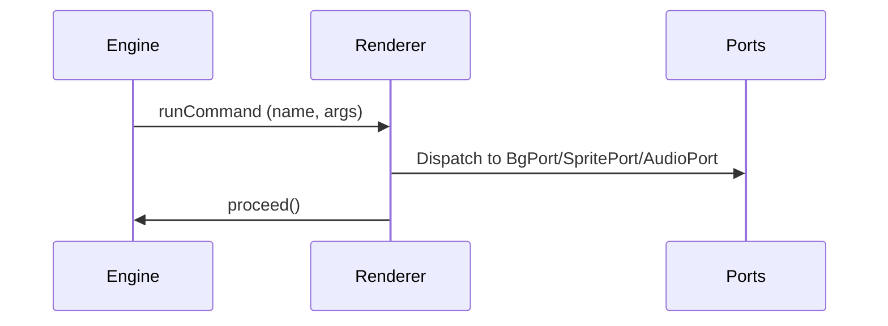

# Visual Novel Engine (monorepo)

Modern, modular Visual Novel engine for web and native. Built with TypeScript and React, designed around a simple pull-based engine contract and pluggable renderers.


---

## Table of Contents

- Quickstart
- Monorepo Overview
- Install and Build
- Run the Example Apps
- Using the Engine in Your App (local dev)
- Docs: Authoring, DSL, Publishing
- Commands System (engine ↔ renderer contract)
- Milestones & Roadmap
- Architecture Overview
- Features
- Troubleshooting & FAQ

---

## 🚀 Quick Start for Creators

**Want to create a visual novel? This is the fastest way:**

```bash
# 1. Get the engine
git clone https://github.com/DianaABA/vnEngine.git
cd vnEngine

# 2. Set up the engine (one-time setup)
npm install
npm run build:packages

# 3. Create your visual novel project  
node packages/cli/bin/vn.js create my-awesome-novel
cd my-awesome-novel

# 4. Install and run
npm install
npm run dev
```

**Your visual novel is now running at http://localhost:3000!** 🎉

Edit `public/scripts/main.json` to change your story, and add images to `public/assets/` folders.

📖 **New to VN creation?** Check out our [Getting Started Guide](docs/GETTING_STARTED.md)

---

## Developer Quickstart

**Contributing to the engine or running examples:**

- Requirements: Node.js 18+ and npm 8+.
- Install deps: npm install
- Build engine packages (core + renderer): npm run build:packages
- Run tests: npm test
- Typecheck all packages: npm run typecheck
- Run the demo web app (webpack): npm start (terminal prints the URL, e.g., http://localhost:8081)
- Run the author app (Vite): npm run dev -w apps/author (http://localhost:5173)
- Run the clean smoke test app (Vite): npm run dev:zero (defaults to http://localhost:3100; will use a free port if taken)
- Try the starter template (Vite): npm run dev:template (http://localhost:3102)

You can also use VS Code: F5 on "Launch Web App (webpack)" or "Launch Author App (Vite)". Tasks for build, test, lint, and typecheck are included in .vscode/tasks.json.

---

## Monorepo Overview

Packages (consumable):
- `@vn/core` – Engine: node graph traversal (next/proceed/choose), instruction stream, flags, and snapshots.
- `@vn/renderer-web` – React VNPlayer that renders a `GameScript` via the engine, dispatching `runCommand` to platform ports.

Apps (for demos and tooling):
- `apps/web-demo` – Legacy demo using webpack.
- `apps/author` – Authoring UI prototype (Vite).
- `apps/chakrahearts-zero` – Minimal clean app to smoke test engine + renderer end-to-end.

---

## Install and Build

1) Install dependencies

```powershell
npm install
```

2) Build engine packages (creates `packages/*/dist`)

```powershell
npm run build:packages
```

3) Run tests and typecheck

```powershell
npm test
npm run typecheck
```

---

## Run the Example Apps

- Demo (webpack):

```powershell
npm start
```

Opens the printed localhost URL (e.g., http://localhost:8081)

- Author app (Vite):

```powershell
npm run dev -w apps/author
```

Opens http://localhost:5173

- ChakraHearts Zero smoke test (Vite):

```powershell
npm run dev:zero
```

Opens http://localhost:3100 (or the port printed by Vite) and shows a compact scene demonstrating:

- Background transitions (crossfade)
- Camera pan/zoom with easing
- Shake effect
- Timed choices with an animated countdown ring
- Conditional choices (hidden via visibleIf; disabled via enabledIf)
- Variable-driven logic (setVar; expressions in conditions like affinity >= 3 and hasKey || route == 'A')

This is ideal for quickly verifying engine + renderer features.

- Starter Template (Vite):

```powershell
npm run dev:template
```

Opens http://localhost:3102 and loads `apps/template-basic/public/scripts/main.json` with backgrounds from `apps/template-basic/public/assets/backgrounds`.

---

## Renderer-Web Player Controls

The React renderer (`@vn/renderer-web` → `VNPlayer`) includes built-in UX helpers:

- Backlog: Shows previous dialogue lines
	- UI: Backlog button (top-right)
	- Shortcut: B
- Auto: Auto-advance dialogue after a short delay proportional to text length
	- UI: Auto toggle + Speed slider (0.5x–3x)
	- Shortcut: A
	- Behavior: Pauses on choices and during visual transitions
- Skip: Fast-forward to the next choice (or end)
	- UI: Skip toggle
	- Shortcut: S
	- Behavior: Skips non-choice dialogue/commands; stops at choices/end and honors transitions
- Quick Save/Load: A single quick slot that stores engine snapshot + a thumbnail
	- UI: Save / Load buttons
	- Storage: localStorage key `vn_quick_slot_1`
	- Thumbnail: 320x180 image generated from background and current dialogue overlay

	- Timed Choices: Auto-select after timeout
		- UI: Countdown ring shows remaining seconds
		- Behavior: Honors defaultIndex if specified; choices can be disabled

Visual transitions (web):
- Background: fade, crossfade, slide (left/right/up/down) with duration
- Sprites: fade-in for new sprites and smooth move updates when re-showing the same id
- Audio: fade in/out on play/stop

---

## Using the Engine in Your App (local dev)

Until packages are published, you can consume them locally from this repo:

1) Build the packages here (once):

```powershell
cd path\to\vnEngine
npm install
npm run build:packages
```

2) In your app’s `package.json`, add local file deps:

```json
{
	"dependencies": {
		"@vn/core": "file:../vnEngine/packages/core",
		"@vn/renderer-web": "file:../vnEngine/packages/renderer-web"
	}
}
```

3) If you use Vite + TS, add aliases/paths pointing at the package folders (so dev mode resolves sources) and rely on built `dist` types:

- Vite `resolve.alias`:

```ts
import path from 'node:path'
export default {
	resolve: {
		alias: {
			'@vn/core': path.resolve(__dirname, '../vnEngine/packages/core'),
			'@vn/renderer-web': path.resolve(__dirname, '../vnEngine/packages/renderer-web')
		}
	}
}
```

- TS `paths` (to types generated in `dist`):

```json
{
	"compilerOptions": {
		"paths": {
			"@vn/core": ["../vnEngine/packages/core/dist/src/index.d.ts"],
			"@vn/renderer-web": ["../vnEngine/packages/renderer-web/dist/index.d.ts"]
		}
	}
}
```

4) Use the React renderer in your app:

```tsx
import { VNPlayer } from '@vn/renderer-web'
import type { GameScript } from '@vn/core'

const script: GameScript = {
	scenes: [
		{
			id: 'intro',
			nodes: {
				start: { id: 'start', kind: 'dialogue', speaker: 'Ava', text: 'Hello!', next: 'end' },
				end: { id: 'end', kind: 'end' }
			},
			start: 'start'
		}
	],
	startScene: 'intro'
}

export default function App() {
	return <VNPlayer script={script} />
}
```

---

## Author Workflow: Drop scripts and assets

The engine accepts an author-friendly JSON format and normalizes it for runtime.

Place your files like this (see `apps/template-basic` for a working example):

```
public/
	assets/
		backgrounds/
			room.jpg
			street.jpg
	scripts/
		main.json
src/App.tsx
```

Map keys to files in `src/App.tsx` when constructing the `assets` prop for `VNPlayer`:

```ts
const assets = {
	backgrounds: {
		room: '/assets/backgrounds/room.jpg',
		street: '/assets/backgrounds/street.jpg'
	}
}
```

Author-friendly script example (`public/scripts/main.json`):

```json
{
	"startScene": "intro",
	"scenes": [
		{
			"id": "intro",
			"start": "n1",
			"nodes": [
				{ "type": "dialogue", "id": "n1", "speaker": "Ava", "text": "Hello!", "next": "end" },
				{ "type": "end", "id": "end" }
			]
		}
	]
}
```

The loader also accepts already-normalized engine shape.

---

## 🛠️ VN CLI - Complete Project Management

The VN CLI provides everything you need to create, develop, and deploy visual novels:

### Project Creation
```bash
vn create my-novel              # Create a complete VN project with all dependencies
vn init simple-project          # Create basic script structure only
```

### Development
```bash
vn dev                          # Start development server with hot reload
vn build                        # Build optimized production version
vn serve                        # Preview production build locally
```

### Asset Management
```bash
vn assets scan                  # Discover and catalog all project assets
vn assets validate              # Check for missing assets referenced in scripts
vn assets optimize              # Compress and optimize assets (coming soon)
```

### Quality Assurance
```bash
vn validate scripts/main.json   # Validate script syntax and structure
```

### Deployment
```bash
vn deploy github                # Deploy to GitHub Pages (guided setup)
vn deploy netlify               # Deploy to Netlify (guided setup)
vn deploy vercel                # Deploy to Vercel (guided setup)
```

The CLI handles all the complex setup so you can focus on creating your story!

---

# Docs

- Authoring (no-code friendly): `docs/AUTHORING.md`
- DSL syntax: `docs/DSL.md`
- Publishing (Web & Mobile): `docs/PUBLISHING.md`

---

# Commands System

## Command Table

| Command Name   | Args Schema                                              | Typical Effect         | Executed By |
|--------------- |---------------------------------------------------------|-----------------------|-------------|
| setBackground  | { name: 'setBackground', key: string }                  | Change background     | BgPort      |
| showSprite     | { name: 'showSprite', id: string, pose?: string, at? }  | Show sprite           | SpritePort  |
| hideSprite     | { name: 'hideSprite', id: string }                      | Hide sprite           | SpritePort  |
| playMusic      | { name: 'playMusic', idOrUrl: string, loop?: boolean }  | Play music/audio      | AudioPort   |
| stopMusic      | { name: 'stopMusic', id?: string }                      | Stop music/audio      | AudioPort   |
| setFlag        | { name: 'setFlag', key: string, value: boolean }        | Set engine flag       | Renderer    |
| setVar         | { name: 'setVar', key: string, value: any }             | Set engine variable   | Renderer    |
| wait           | { name: 'wait', ms: number }                            | Pause before proceed  | Renderer    |
| changeScene    | { name: 'changeScene', sceneId: string, nodeId?: string } | Switch scene & jump | Renderer→Engine |
| shakeBackground| { name: 'shakeBackground', durationMs: number, intensity?: number } | Shake camera/bg | Renderer    |
| camera         | { name: 'camera', xPct?: number, yPct?: number, scale?: number, durationMs?: number, easing?: string } | Pan/zoom camera | Renderer    |
| choiceTimer    | { name: 'choiceTimer', timeoutMs: number, defaultIndex?: number }   | Timed choice auto-pick | Renderer |

## Sequence Diagram



## Notes
- The engine emits runCommand instructions for command nodes; renderer performs the side effects and then calls engine.proceed().
- Flags and variables mutate only when renderer calls engine.setFlag / engine.setVar.
- Conditions can reference flags or variables and support `!name`, comparisons (`== != > >= < <=`), and logical `&&` / `||` (no parentheses).

### Conditional Choices
- Each choice can define:
	- `visibleIf`: hide the choice when false (alias: `condition`)
	- `enabledIf`: show but disable the choice when false
- The `showChoices` instruction includes `{ disabled?: boolean }` per choice; the web renderer displays disabled options with muted styling.
# VNEngine Monorepo Milestone Summary & Roadmap

## 1. Core Modules Status
- ✅ Core engine (`NodeVNEngine`): node graph traversal (next/proceed/choose), instruction stream, snapshots
- ✅ Script package: JSON schema + types; DSL stubs present
- ✅ Renderer-web (`VNPlayer`): React renderer aligned to engine pull API; dialogue, choices, runCommand, end
- ✅ Storage (local adapters): basic slot-based save/load
- ✅ Tests: core engine traversal/branching/commands covered by vitest
- ✅ New clean app: `apps/chakrahearts-zero` minimal smoke test (Vite)
- ☑️ Author app prototype: Vite-based playground (work-in-progress)
- ✅ Assets/ports: background/sprites/audio ports wired with handlers; web adds fade/crossfade/slide + sprite fade/move + audio fades

## 2. Progress Checklist
- ✅ Core engine: modular, node-based, snapshot/hydrate
- ✅ Script: JSON schema/types, validators; DSL scaffolding
- ✅ Renderer-web: dialogue, choices, runCommand dispatch; keyboard UX
- ✅ Smoke tests: `chakrahearts-zero` app exercises core loop
- ✅ Ports: bg/sprite/audio interfaces defined; web impl adds transitions (bg fade/crossfade/slide, sprite fade/move, audio fades)
- ☑️ Storage: local adapters ok; cross-platform adapters pending
- ☑️ Authoring: prototype app exists; parser/editor features in progress
- ❌ Native portability: RN renderer + AsyncStorage adapter
- ❌ Advanced tests: long-form branching, integrity, error reporting CI

## 3. Minimal Test Scenes & CI Checks
- Test scenes:
	- Dialogue with choices, branching, commands (bg/music/flag)
	- Save before choice, load, pick alternate path
- CI checks:
	- Build: `npx tsc --build`
	- Lint: `npx eslint .`
	- Tests: `npx vitest run`

## 4. Release Roadmap
- 0.1.0 (current): Core engine + web renderer playable; save/load; basic branching; zero app
- 0.2.0: Renderer polish (backlog, auto, skip, quick save/load with thumbnails, bg slide, sprite move) – DONE in alpha
- 0.3.0: Ports polish (sprite layers/positions, WebAudio backend improvements), flags API, error surfaces
- 0.3.0: Authoring tools (split-pane editor, DSL parser MVP, live preview + validator)
- 0.4.0: React Native renderer, AsyncStorage adapter; storage abstractions unified

## 5. Architecture & Contribution Workflow

### Architecture Overview
- Core (engine)
	- `NodeVNEngine` exposes a pull-based loop: `next()` → instruction; renderer handles then calls `proceed()` or `choose(id)`.
	- Instructions include: `showDialogue`, `showChoices`, `runCommand`, `showBranch`, `end`.
	- Snapshot/hydrate for save/load.
- Renderer (web)
	- `VNPlayer` React component renders the instruction stream.
	- Dispatches `runCommand` to platform ports and then calls `engine.proceed()`.
- Ports
	- Background, Sprites, Audio ports define minimal contracts; web implementations are basic and ready to extend (transitions/effects pending).
- Script
	- JSON schema/types for `GameScript`; DSL parser stubs and validators.
- Storage
	- Local slot-based adapters; async/native adapters planned.
- Apps
	- `web-demo`, `author` prototype, and `chakrahearts-zero` smoke test.

### Contribution Workflow
1. Fork & clone repo, install dependencies (`npm install`)
2. Build all packages (`npx tsc --build`)
3. Run demo app (`npm start` or via Vite)
4. Add features/tests in modular packages
5. Submit PRs with clear checklist, tests, and documentation

# vnEngine

A scalable, modular Visual Novel engine built with React, TypeScript, and Turborepo monorepo structure.

## Features
- Node-based engine core with pull API (next/proceed/choose)
- Dialogue, choices, command dispatch, branching
- Background/Sprites/Audio ports (web impl basic; extensible)
- Snapshot/save/load support
- JSON script format with schema/types; DSL scaffolding
- React web renderer (`VNPlayer`)
- Example apps: webpack demo, author prototype, and chakrahearts-zero

## Troubleshooting & FAQ

- The zero app can’t import @vn/core or @vn/renderer-web
	- Build the packages first in this repo: `npm run build:packages`.
	- With Vite, ensure `resolve.alias` points to package folders and TS `paths` point to `dist` declaration files as shown above.

- Pre-commit hook fails with ESLint config warnings
	- This repo uses ESLint flat config (`eslint.config.js`). If you see messages about `.eslintignore`, you can proceed; commits are unblocked and lint can be adjusted later.

- Ports don’t do anything
	- Background/Sprites/Audio web ports are minimal. 0.2.0 will add transitions, layering/positions, WebAudio fades/looping.

- Use from a different app (outside monorepo)
	- See “Using the Engine in Your App (local dev)”. Use local file deps, add Vite aliases and TS paths, and build packages here once.

## Getting Started
See the monorepo structure and packages for usage examples.
